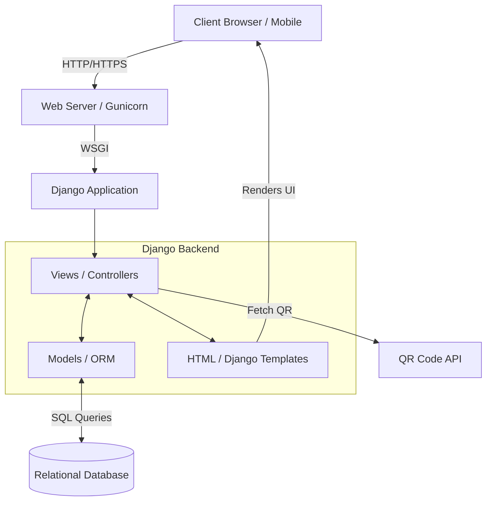
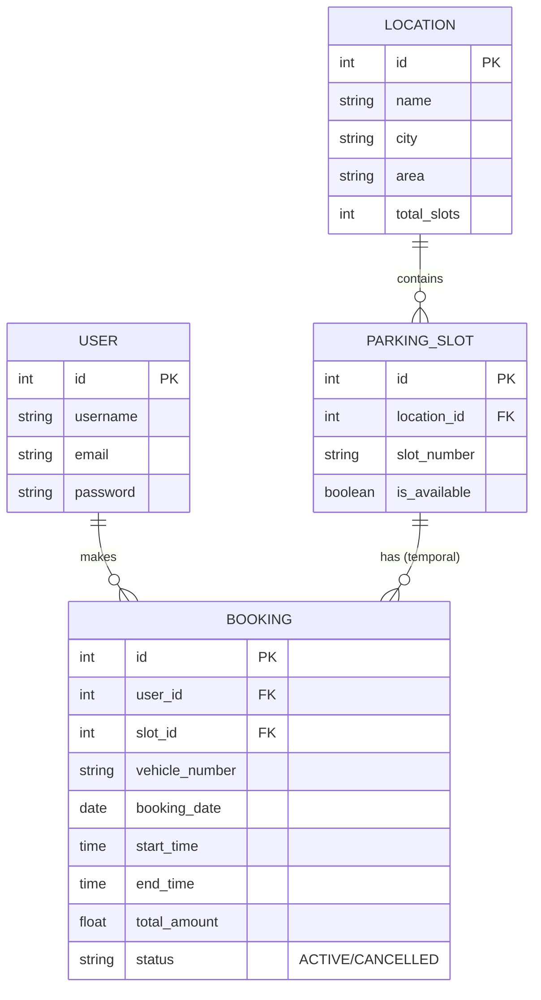
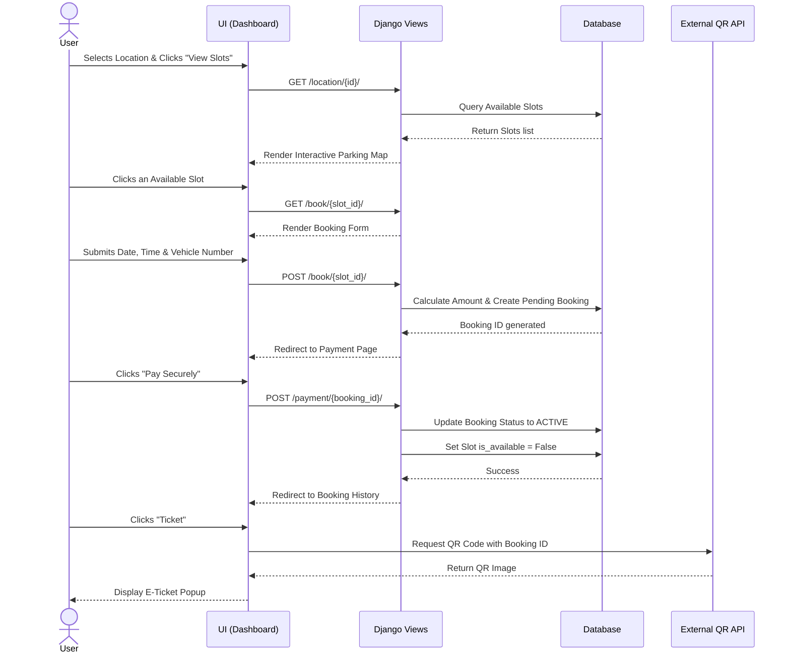

# Software Requirements Specification (SRS) & System Design
**Project:** ParkKaro (Parking Management System)
**Version:** 1.0

---

## 1. Problem Identification & Objective

### 1.1 The Problem
In rapidly growing urban environments, finding an available parking spot in commercial areas (malls, hospitals, offices) is a major challenge. 
* **Time & Fuel Wastage:** Drivers spend excessive time circling for parking, leading to fuel waste and increased traffic congestion.
* **Lack of Real-time Visibility:** Drivers have no way of knowing if a parking lot is full before arriving.
* **Inefficient Management:** Manual ticketing systems are prone to human error, cash handling issues, and lack data analytics for parking operators.

### 1.2 The Solution (ParkKaro)
ParkKaro is a centralized web-based parking management system that allows users to:
* Discover nearby parking locations and view real-time slot availability.
* Pre-book premium parking slots via an interactive graphical seat-map.
* Manage their bookings (Extend time, Cancel bookings) dynamically.
* Utilize digital E-Tickets (QR Codes) for seamless entry and exit.

---

## 2. High-Level Design (HLD)

The High-Level Design outlines the overall architecture of the application. ParkKaro follows a classic **Model-Template-View (MTV)** architecture powered by the Django web framework.

### 2.1 System Architecture

### 2.2 Core Modules
1. **Authentication Module:** Handles user registration, login, and session management.
2. **Location & Slot Module:** Manages parking locations and individual slot states (Available/Booked).
3. **Booking & Transaction Module:** Handles reservation logic, time calculations, pricing, cancellations, and time extensions.

---

## 3. Low-Level Design (LLD)

The Low-Level Design defines the database schema and the specific interactions between internal components.

### 3.1 Entity-Relationship Diagram (ERD)

### 3.2 Key Algorithms & Logic
* **Slot Availability Check:** A slot is marked `is_available = False` immediately upon a successful booking. In a production environment, cron jobs or background tasks (Celery) would monitor the `end_time` and automatically revert the slot to `True` when the booking expires.
* **Refund Calculation Logic:** If a user cancels an active booking, a 10% cancellation fee is deducted from the `total_amount` (with a minimum cap of ₹5 and a maximum cap of the total amount).
* **Extension Logic:** Extending a booking adds hours to the `end_time` and strictly calculates additional charges (e.g., +₹20 per hour) dynamically without requiring a new booking entry.

---

## 4. User Flow & Sequence Diagrams

### 4.1 Booking Sequence Flow
The following diagram illustrates the exact chronological flow when a user attempts to book a parking slot.

---

## 5. Non-Functional Requirements
1. **Responsiveness:** The UI (Interactive map, History cards) must adapt to mobile devices.
2. **Usability:** Implement a strict visual hierarchy using premium CSS (Glassmorphism, hover interactions) to reduce user cognitive load.
3. **Security:** Implement CSRF protection on all forms and ensure user data (passwords) is hashed using Django's default PBKDF2 algorithm.

---
*Document Generated for ParkKaro - 2026*
