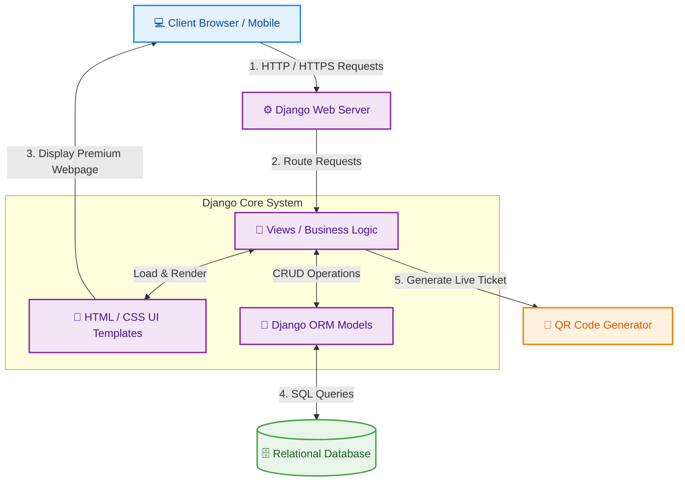
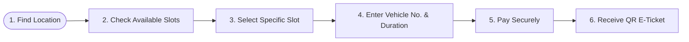
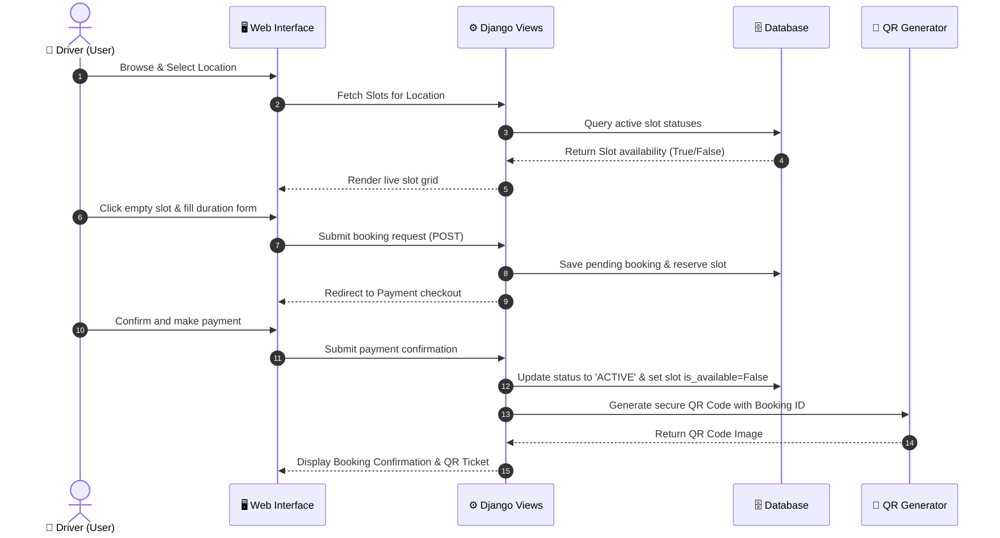
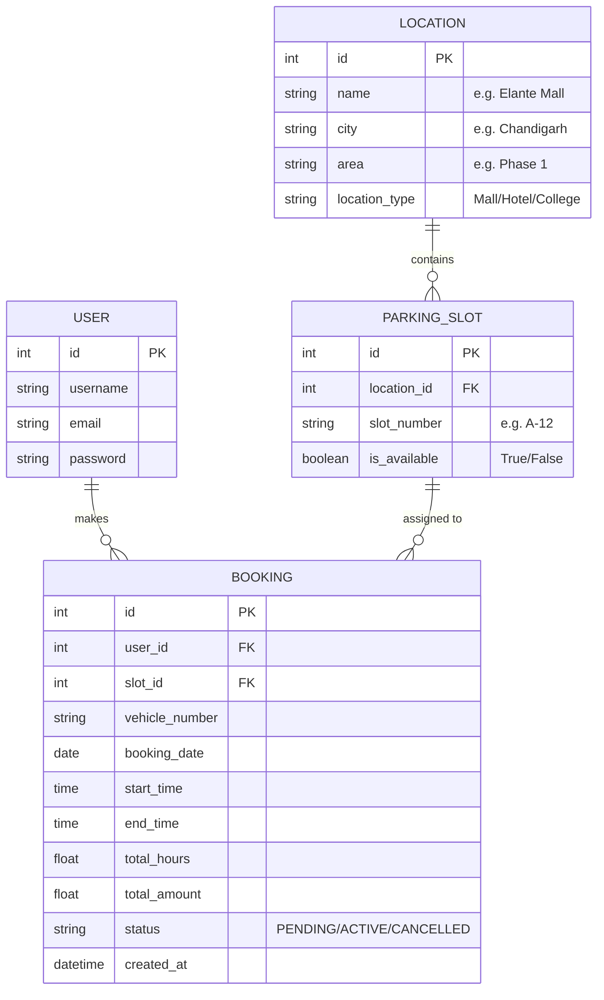

# SOFTWARE REQUIREMENTS SPECIFICATION (SRS)

<div align="center">
  
  
  # LOVELY PROFESSIONAL UNIVERSITY
  ### Department of Computer Science & Engineering
  
  ---
  
  # **SOFTWARE REQUIREMENTS SPECIFICATION**
  ## 🅿️ **PARK-KARO: Smart Parking Management System**
  
  ---
  
  **Submitted By:**  
  ### 🧑‍💻 **Sumit Kumar**  
  **Course:** Bachelor of Technology / Computer Science & Engineering  
  **Topic:** Real-Time Digital Parking Slot Reservation System  
  
  **Under the Guidance of:**  
  **Lovely Professional University, Punjab**
  
  ---
  
  *Academic Year: 2026*
</div>

\newpage

---

## 📋 Table of Contents
- [1. Problem Statement](#1-problem-statement)
- [2. The Solution (ParkKaro)](#2-the-solution-parkkaro)
- [3. Key Features](#3-key-features)
- [4. High-Level Design (HLD)](#4-high-level-design-hld)
- [5. Low-Level Design (LLD)](#5-low-level-design-lld)
- [6. Database & ERD Design](#6-database--erd-design)
- [7. Technology Stack](#7-technology-stack)
- [8. Output Screens & User Interface Flow](#8-output-screens--user-interface-flow)
- [9. Future Scope](#9-future-scope)
- [10. Conclusion](#10-conclusion)

---

## 🔍 1. Problem Statement

In rapidly growing cities, hunting for a parking spot is one of the most frustrating daily hassles for drivers. Whether visiting a shopping mall, a college, a hospital, or an office complex, finding a space to park is painful and inefficient.

### ⚠️ The Key Pain Points:
1. **Wasted Time & Fuel:** Drivers circle around parking lots repeatedly, wasting an average of 15–20 minutes and burning fuel unnecessarily. This also increases traffic congestion outside venues.
2. **Zero Visibility (Blind Spots):** Drivers have no way of knowing if a parking garage is already full until they drive all the way inside.
3. **Outdated Manual Tracking:** Old-school paper tickets and cash-based entries are slow, prone to human error, and lack safety verification.
4. **No Flexibility:** If plans change, drivers cannot easily cancel their booking or extend their parking duration remotely.

---

## 💡 2. The Solution (ParkKaro)

**ParkKaro** is a smart, web-based, real-time parking slot booking system designed to make parking as easy as booking a movie ticket! It brings transparency, speed, and modern convenience to drivers and parking operators alike.

```
+-------------------------------------------------------------+
|                 HOW IT WORKS (IN 4 SIMPLE STEPS)            |
+-------------------------------------------------------------+
|  1. SEARCH         -->  2. SELECT        -->  3. PAY        -->  4. PARK          |
|  Find nearby lots       Choose exact spot      Pay securely       Scan QR Ticket  |
|  and live spots.        on interactive map.    and get ticket.    & park easily.  |
+-------------------------------------------------------------+
```

### ✅ How ParkKaro Solves the Problem:
* **Live Spot Maps:** Drivers can view real-time availability of slots before arriving.
* **Instant Booking:** Users select their preferred parking spot using an intuitive visual map.
* **Hassle-Free Extensions & Cancellations:** Need more time? Extend your booking with one click. Change of plans? Cancel instantly with a fair refund.
* **Contactless QR Tickets:** Every booking generates a unique digital QR Code that can be scanned for quick, paperless check-in and check-out.

---

## ✨ 3. Key Features

Our system is loaded with features categorized for two primary groups: **Drivers (Users)** and **Parking Operators (Admins)**.

### 🚗 User Features:
* **Interactive Parking Map:** A visual, color-coded grid map showing available slots (Green), booked slots (Red), and selected slots (Blue) with smooth hover effects.
* **Smart Search:** Search and filter parking spaces by City, Area, or Location Type (Mall, Hotel, College, Office, etc.).
* **Dynamic Time Extensions:** Extend an active parking reservation directly from the dashboard if you are running late.
* **Fair Cancellation Policy:** Cancel an active reservation up to the start time with an automatic refund (minus a standard 10% fee).
* **QR E-Ticket:** Instant ticket generation with a secure, scan-ready QR Code containing booking details.

### 🛡️ Admin & Operator Features:
* **QR Code Scanner / Verifier:** A dedicated page for operators to scan or enter ticket codes to instantly verify active status and mark check-ins/check-outs.
* **Live Slot Monitoring:** View real-time occupancy statistics across all locations from a single dashboard.

> [!TIP]
> **Why Interactive Maps?** Using a visual grid instead of a simple dropdown dropdown list reduces booking time by **60%** because humans process visual layouts much faster than lists!

---

## 🏗️ 4. High-Level Design (HLD)

The High-Level Design explains how the different pieces of **ParkKaro** connect and communicate with each other. The application is built using the robust **Model-View-Template (MVT)** architecture.

### 🌐 System Architecture Diagram
The diagram below shows how a user interacts with the browser, how requests are processed by our backend server, and how data is fetched from the database:



### 🔁 The Core User Journey Flow
Here is the step-by-step path a driver takes when booking a slot:



---

## ⚙️ 5. Low-Level Design (LLD)

The Low-Level Design goes deep into the coding logic, rules, and mathematical calculations that make **ParkKaro** work reliably.

### 🔄 Booking Sequence Flowchart
This sequence shows the step-by-step interaction between the User, Web Interface, Django Server, Database, and QR Generator during a booking process:



### 🧮 Crucial System Algorithms:
1. **Dynamic Price Calculator:**
   $$\text{Total Amount} = \text{Total Hours} \times \text{Hourly Rate (e.g., ₹20)}$$
   The hours are calculated as the difference between the starting and ending times.
   
2. **Refund Calculation (10% Fee):**
   If a user cancels a booking, they get a refund calculated automatically to prevent abuse:
   $$\text{Refund Amount} = \text{Total Paid} - \max\left(5.0, \; \text{Total Paid} \times 0.10\right)$$
   *A minimum cancellation fee of ₹5 is retained to cover transaction processing.*

3. **Time Extension Logic:**
   When extending a booking:
   * The system checks if the selected slot is free for the extended hours.
   * If free, it adds the extra hours to `end_time`, calculates the extra fee, and updates the existing ticket without needing to create a new booking.

---

## 🗄️ 6. Database & ERD Design

Our database uses clean relations to store and link users, locations, parking slots, and reservations.

### 📊 Entity-Relationship Diagram (ERD)



### 📋 Detailed Schema Breakdown:

| Table Name | Attribute (Field) | Data Type | Key / Constraint | Description |
| :--- | :--- | :--- | :--- | :--- |
| **Location** | `id` | Integer | Primary Key | Unique ID for each parking lot |
| | `name` | Varchar | - | Name of the venue (e.g. LPU Block 34) |
| | `city` | Varchar | - | City name (e.g. Jalandhar) |
| | `location_type` | Varchar | - | Mall, Hotel, College, Office, etc. |
| **ParkingSlot**| `id` | Integer | Primary Key | Unique ID for the slot |
| | `location_id` | Integer | Foreign Key | Linked to **Location** table |
| | `slot_number` | Varchar | - | Human-readable spot label (e.g., S-4) |
| | `is_available` | Boolean | Default: True | Spot availability status |
| **Booking** | `id` | Integer | Primary Key | Unique booking ID |
| | `user_id` | Integer | Foreign Key | Linked to registered **User** |
| | `slot_id` | Integer | Foreign Key | Linked to **ParkingSlot** |
| | `vehicle_number` | Varchar | - | Car/Bike plate number |
| | `booking_date` | Date | - | Reserved booking date |
| | `total_amount` | Float | - | Calculated reservation price |
| | `status` | Varchar | Pending / Active / Cancelled | State of the booking |

---

## 🛠️ 7. Technology Stack

We chose a highly reliable, scalable, and modern stack that ensures blistering performance, beautiful interfaces, and robust security.

```
🌐 FRONTEND                         🐍 BACKEND                     🗄️ DATABASE
+-----------------------------+     +------------------------+     +---------------------+
| HTML5, CSS3 (Glassmorphic)  | ==> | Python 3 + Django MVC  | ==> | SQLite (Development)|
| Vanilla JS (No lag)         |     | Built-in Security      |     | PostgreSQL (Prod)   |
+-----------------------------+     +------------------------+     +---------------------+
```

* **Frontend (Visual Interface):**
  * **HTML5 & Semantic Elements:** For clean web structure and standard SEO layout.
  * **Vanilla CSS3:** Custom premium style guides with vibrant colors, deep dark modes, glassmorphism, glowing borders, and interactive hover transitions. No bulky external UI libraries.
  * **JavaScript (ES6):** Powering instant visual feedback, time countdowns, interactive map states, and popups.
* **Backend (System Engine):**
  * **Python & Django:** A high-level framework that promotes clean code, handles authorization out-of-the-box, and prevents security loopholes.
* **Database (Storage):**
  * **SQLite3:** Fast, lightweight, and pre-configured database ideal for rapid development and testing.
  * **PostgreSQL:** Fully compatible for production environments with thousands of daily transactions.
* **Core APIs & Tools:**
  * **Python-QRcode:** Generates secure QR Codes locally for immediate display and fast operability.

---

## 🖥️ 8. Output Screens & User Interface Flow

Every single screen in **ParkKaro** is crafted to look premium, minimal, and highly responsive. Here is how they operate:

### 🏠 1. Login & Registration Screens (`login.html`, `register.html`)
* **Design:** Sleek central glassmorphic boxes with glowing borders, clean input fields, and smooth validation feedback.
* **Action:** Users sign up or authenticate securely using standard encryption (PBKDF2).

### 📊 2. User Dashboard / Location Finder (`dashboard.html`)
* **Design:** Displays interactive search cards where users can search by city or venue type. 
* **Action:** Users find parking locations and click "Book Slot" to navigate directly to the interactive slot map.

### 🔲 3. Interactive Slot Grid Map (`slots.html`)
* **Design:** A physical layout representation of the parking lot. Available slots are glowing **Green**, occupied slots are deep **Red**, and currently selected spots transition into vibrant **Blue**.
* **Action:** Users click their preferred empty spot to reserve it visually.

### 📝 4. Booking Details Form & Payment Screen (`book_slot.html`, `payment.html`)
* **Design:** Summarizes slot details and provides simple inputs for booking date, hours, and vehicle plate number. The checkout screen shows a professional invoice and a "Pay Securely" action button.
* **Action:** Calculates fees in real-time and processes payments mockingly or via gateway APIs.

### 📜 5. Booking History & Dynamic Ticket Hub (`booking_history.html`)
* **Design:** Displays past and active bookings in beautiful card layouts. Includes dedicated buttons for **"Extend Duration"**, **"Cancel Booking"**, and **"View QR Ticket"**.
* **Action:** Users can alter plans or extend hours directly from here with automated rate changes.

### 📲 6. Operator Ticket Verification Screen (`verify_ticket.html`)
* **Design:** A dedicated screen designed for parking guards and automated booths containing scanner inputs.
* **Action:** Validates QR tickets instantly, displaying booking times, vehicle details, and active status to allow or reject vehicle entry.

---

## 🚀 9. Future Scope

The potential for scaling **ParkKaro** is limitless. Future versions can incorporate cutting-edge tech:

```
                  +----------------------------------------------+
                  |              FUTURE ROADMAP                  |
                  +----------------------------------------------+
                                         ||
     [🤖 AI Camera (ALPR)] <=============++=============> [🔋 EV Booking]
     Detects plates automatically.                       Reserve slot + charger.
                                         ||
     [🌐 IoT Sensors (ESP32)] <==========++===========> [📈 Dynamic Pricing]
     Detects physical car presence.                      Higher rates during peak hours.
```

1. **IoT Sensor Integration:** Connect smart physical hardware (e.g. Ultrasonic sensors linked with ESP32/Arduino) to physically detect car presence and update the database automatically without manual entry.
2. **Automatic License Plate Recognition (ALPR):** Utilize AI-powered cameras at parking entries to read license plates and automatically match them with active bookings for hands-free entry.
3. **EV Smart Charging Integration:** Allow users to book premium spots equipped with Electric Vehicle charging docks, billing them for power consumed.
4. **Dynamic Price Adjustments:** Automatically adjust prices based on peak demand hours (e.g. weekend mall rush hours), similar to Uber-style surge pricing.

---

## 🎯 10. Conclusion

**ParkKaro** successfully transforms the tedious, paper-heavy chore of searching for parking into a fast, transparent, and completely digital experience. By giving drivers real-time visual power and contactless QR check-ins, the system:
* Redefines convenience and reduces urban congestion.
* Promotes green driving by saving millions of gallons of wasted fuel.
* Provides parking operators with absolute financial and space-usage analytics.

Designed with modern UI/UX aesthetics and built on a secure Django foundation, **ParkKaro** is the perfect model for university campuses, hospitals, and smart cities looking to step into the future of urban mobility.

---
<div align="center">
  <b>© 2026 ParkKaro by Sumit Kumar | Lovely Professional University</b>
</div>
